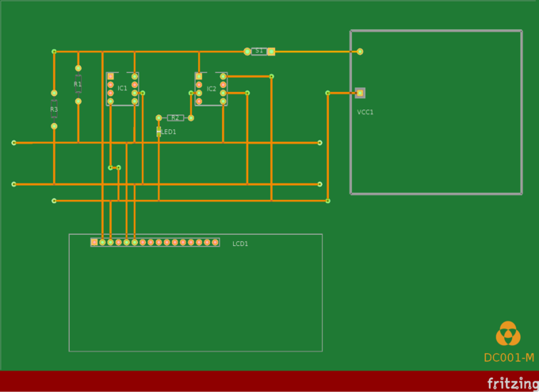

# specifications
The DC001-M protoboard specifications.

_Components:_
+ **IC1**: PICAXE 08M2 (master IC).
+ **IC2**: 24LC16B EEPROM memory (slave IC).
+ **S1**: Horizon PushButton.
+ **LED1**: Orange LED (605nm).
+ **R1**: 4.7K Ω resistor.
+ **R2**: 330 Ω resistor.
+ **R3**: 4.7K Ω resistor.
+ **LCD1**: GDM1602K LCD module.
+ **VCC1**: BatteryPack 4xAAA batteries.

| **Operating/Input Voltage** | **Microcontroler** | **EEPROM (Kb)** | **RAM (Kb)** | **CPU speed (MHz)** | **LCD size**          |
|:---------------------------:|:------------------:|:---------------:|:------------:|:-------------------:|:---------------------:|
| 2.3 - 5V                    | PICAXE-08M2        | 16Kb            | 2Kb          | 32MHz               | 16chars x 2lines       |
